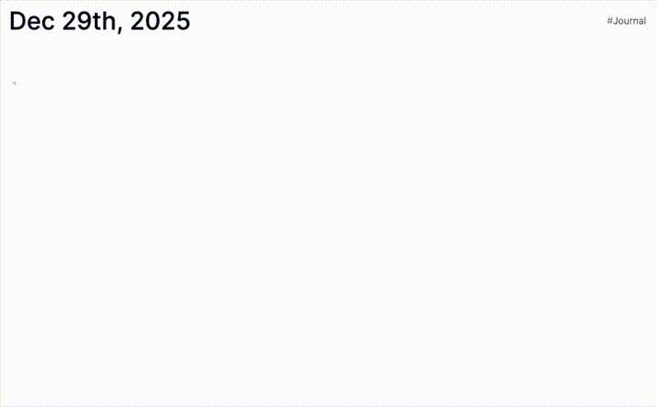

# logseq-freehand-plugin
  

> Embed simple, hand-drawn sketches and diagrams directly into your Logseq notes.

---

## ✨ Features
- Draw directly within your block hierarchy. Sketches are rendered natively as SVGs.
- Drawings are automatically saved as JSON data in a child block, keeping your graph clean and portable.
- Includes a floating toolbar to switch colors (Black, Red, Blue, Green) and clear the canvas.

## 📸 Screenshots / Demo

## ⚙️ Installation
1. Open Logseq.
2. Go to the **Marketplace** (Plugins > Marketplace).
3. Search for **logseq-freehand-plugin**.
4. Click **Install**.

## 🛠 Usage & Settings

#### Starting a Sketch
1. In any block, type the slash command:
`/Freehand: Start sketching`
2. A drawing canvas (800x400px) will appear below the block.

#### Drawing Tools
The plugin includes a floating toolbar inside the canvas area:
* **Colors:** Tap the color swatches to switch ink color (Black, Red, Blue, Green).
* **Clear:** Click the "Clear" button to wipe the canvas and start over.
* **Save:** Saving is automatic. Just click away or stop drawing; the data is persisted immediately to the child block.

#### Data Storage
* The plugin stores your stroke data in a **child block** underneath the renderer.
* The data is saved as raw JSON.
* **Note:** Do not manually edit the child block's content unless you want to modify the coordinate data directly.

## ☕️ Support
If you enjoy this plugin, please consider supporting the development!

  &nbsp;

## 🤝 Contributing
Issues are welcome. If you find a bug, please open an issue. Pull requests are not accepted at the moment as I am not able to commit to reviewing them in a timely fashion.

## ❤️ Credits
* **[perfect-freehand](https://github.com/steveruizok/perfect-freehand):** The library powering the stroke rendering.
